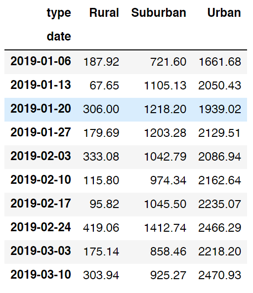

# PyBer_Analysis

## Overview of Analysis
In this analysis designed to discover Taxi fare rates based on city type we better understand dataframes through manipulations such as groupby and pivot as well as ploting with matplotlib. We find that the data covers about five months of entries which we refine into an weekly average resampled dataframe for our subplots. We have three city types of concern being Urban, Suburban, and Rural.

## Results
From types Rural to Suburban to Urban, the features Total_Rides, Total_Drivers, and Total_Fares in our summary dataframe seem to increase almost exponentially. This is likely due to the level of demand from traffic in these particular areas. Rural has the least demand and Urban has the greatest. When looking at Average_Fare_per_Ride and Average_Fare_per_Driver, we see a continuous decrease in fair as we move from Rural to Urban. This is likely due to the structural environment being less condensed and therefore requiring more distance for traveling. 

## Summary
In summarizing this data, the following recommendations should be taken into consideration by our taxi company CEO:
1. The company should hold more drivers and resources in Urban cities where the demand is the greatest to have the most consistent Traffic for business.
2. If the company still prefers to offer services to rural areas, it may be ideal to perform research to find the rural cities with highest demand to minimize loss.
3. Fare seems to peak for all city types near the end of February. That should be a noteable point in yearly history for the company's expendature of resources.
